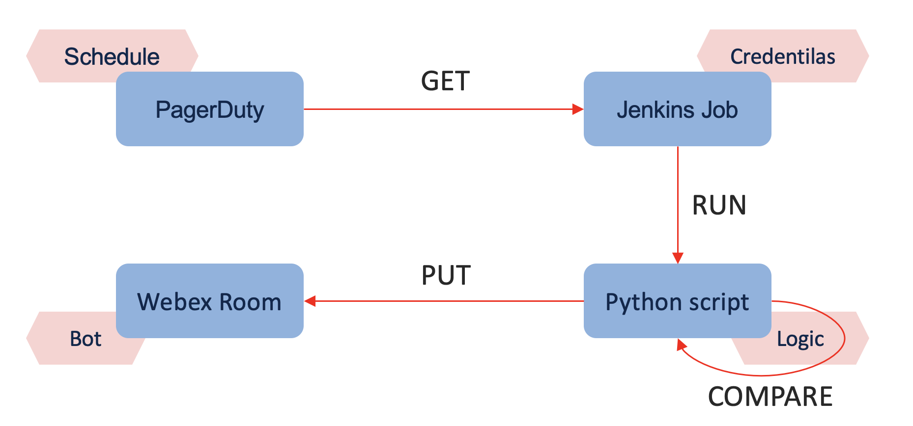

# Webex Room Title Updater
Update SRE team's Webex Room Title with current on-call engineer username from PagerDuty

## Overview

This Python script is designed to update the title of a Webex room with information about the on-call engineer retrieved from PagerDuty schedule. 
It automates the process of reflecting the current on-call engineer in the Webex room title.

## Flowchart


## Prerequisites

Before using the script, ensure you have the following:

- Python 3 installed
- Dependencies installed: `json`, `os`, `requests`

## Setup

1. Clone the repository:
   ```bash
   git clone <repository_url>
   ```
2. Set up environment variables:
- `webex_bot_token`: Webex bot token.
- `pagerduty_api_key`: PagerDuty API key.

3. Update script variables:
- `webex_room_id`: Webex room ID.
- `pagerduty_schedule_ids`: PagerDuty schedule IDs.

## Usage
```
python annotate_oncall_to_webex.py
```

## Functionality

1. get_oncall_pagerduty_user():
- Retrieves the on-call engineer's email from PagerDuty.
2. get_old_webex_title():
- Retrieves the current title of the Webex room.
3. make_webex_title(pattern, users):
- Formats the Webex room title using the specified pattern and on-call engineer's email.
4. compare_webex_titles(new_title, old_title):
- Compares the new and old Webex titles.
5. put_new_webex_title():
- Updates the Webex room title with the new on-call engineer's email.

## Configuration
You will need a Webex Teams bot. Go to https://developer.webex.com/my-apps and
Create A New App -> Bot. The form will prompt you through the process; keep in
mind that the Bot Name and Icon you choose here will be visible in Webex Teams
for all to see. Once you create the bot, you'll be given a value for your Bot
Access Token, which should go into your Jenkins secrets. One
other thing: once your bot is created, you'll need to invite/add that bot to
the channel(s) you wish it to update.

To get PagerDuty schedule id's go to **People -> On-call Schedules**,
then search for the appropriate schedule and copy the id (The last word in the address) from browser address line.

Lastly, Webex room id is most easily acquired by inviting the `RoomID (bot)` to
the relevant Webex Teams room; the bot will hang out for a minute, then leave,
and message you the room's ID.

All secrets should be put as strings into Jenkins Secrets Manager (**NOT key-value pairs**).
In case of PagerDuty schedule id's, put them as **comma-separated string**.

## Get tokens
"pagerduty_schedule_ids" - Get ID here https://org.pagerduty.com/schedules/******
"pagerduty_api_key" - User-level API Token, https://org.pagerduty.com/users/******
